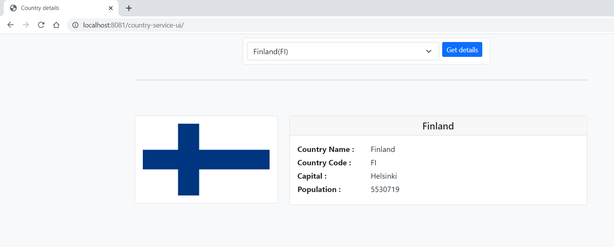
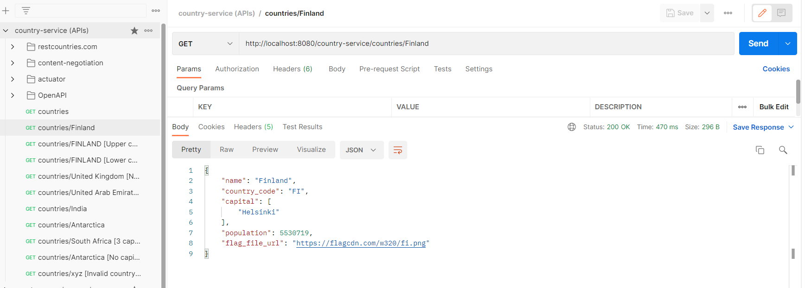
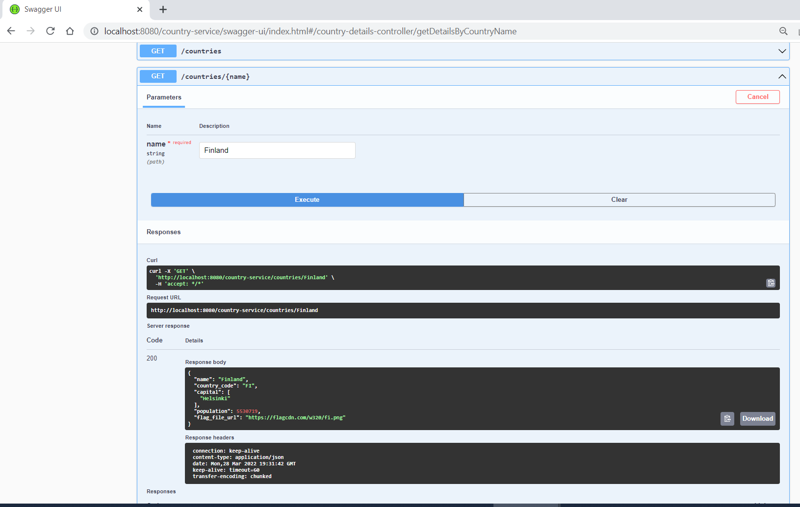

# country-service-app

Project having API calls to get country specific details like country name, country code, capital, population etc.

## Contents
* [Steps to build and run the application](#steps-to-build-and-run-the-application)
* [REST API details](#rest-api-details)
* [Testing the REST APIs](#testing-the-rest-apis)
* [Application monitoring](#application-monitoring)
* [TODO feature list](#todo-feature-list)


## Steps to build and run the application

### Pre-requisites
- JDK 8+
- maven 3

### Build using Maven

1. Run the below command on command prompt or terminal to build the project using maven. 
Go to the country-service-app directory and run the below maven command. 
````
mvn clean install
````
This will build all the 3 modules.
  - country-service-shared
  - country-service
  - country-service-ui

2. Alternatively, the project can be imported to Eclipse or any other IDE and built using IDE build options for maven.
3. Once built successfully, the output jar will be available inside target directory for each of the modules.
4. Run the below command on any command prompt or terminal to start the country-service application. 
This application exposes the REST APIs to get country specific details. 
````
cd country-service-app\country-service
java -jar target\country-service-1.0-SNAPSHOT.jar
````
By default, country-service application runs on 8080 port. To run on a different port (e.g. 9090), run the below command. 
````
cd country-service-app\country-service
java -jar target\country-service-1.0-SNAPSHOT.jar --server.port=9090
````

5. Open another command prompt or terminal to start the country-service-ui application. This has the GUI application 
to consume the REST APIs exposed by country-service application.

````
cd country-service-app\country-service-ui
java -jar target\country-service-ui-1.0-SNAPSHOT.jar
````  
By default, country-service-ui application runs on 8081 port and interacts with country-service REST APIs on 8080 port. 
To run country-service-ui application on a different port (e.g. 9091), run the below command.
````
cd country-service-app\country-service-ui
java -jar target\country-service-ui-1.0-SNAPSHOT.jar --server.port=9091
````

**Note:** country-service-ui application need to know where to look for the REST APIs exposed by country-service.
If country-service is started on any other port other than the default 8080 port (e.g. 9090) ,
then country-service-ui application needs to be started with below parameter.
````
cd country-service-app\country-service-ui
java -jar target\country-service-ui-1.0-SNAPSHOT.jar --countryservice.url=http://localhost:9090/country-service
````
This will start the country-service-ui application 8081 port and consuming the REST APIs from country-service 
running on 9090 port.

6. Once the country-service-ui application started successfully, application UI can be accessed at :  `http://<host>:<port>/country-service-ui/`

 With default 8081 port, UI can be accessed at http://localhost:8081/country-service-ui/

## REST API details

(1) Get country name and code for all countries :

`[GET] http://localhost:8080/country-service/countries`

Below is a partial output of the response.

```json
{
   "countries": [

      {
         "name": "Fiji",
         "country_code": "FJ"
      },
      {
         "name": "Finland",
         "country_code": "FI"
      },
      {
         "name": "France",
         "country_code": "FR"
      }

   ]
}
```

(2) Get details for a country :

`[GET] http://localhost:8080/country-service/countries/Finland`

 This API returns various details like country name, code, capital, population, flag image file url. 

 Sample output is provided below.

```json
{
   "name": "Finland",
   "country_code": "FI",
   "capital": [
      "Helsinki"
   ],
   "population": 5530719,
   "flag_file_url": "https://flagcdn.com/w320/fi.png"
}
```

## Testing the REST APIs

### (a) UI application:
country-service-ui application provides a very simple and intuitive UI to consume the REST APIs.
With default 8081 port, UI can be accessed at http://localhost:8081/country-service-ui/

<details>
  <summary><i>Example : Country service UI</i></summary>
 

</details>


### (b) Postman client:
Postman is a very handy tool to test the REST APIs. Import the API collections which has many predefined API calls
covering many valid and invalid scenarios.

1. Import the Collection v2.1 API to postman. `country-service (APIs).postman_collection.json` (Postman Collection v2.1)
is available in the `country-service-app` directory.
2. Once imported, all the available set of API calls can be used to test the REST endpoint.

<details>
  <summary><i>Example : Postman rest client</i></summary>


</details>


### (c) cURL command:
Below curl command can be used to test the API with different set of country names.

````
curl -s --location --request GET 'http://localhost:8080/country-service/countries'
````

````
curl -s --location --request GET 'http://localhost:8080/country-service/countries/Finland'
````

### (d) Swagger UI (OpenAPI):
 Swagger UI allows visualizing and interact with the API’s exposed by country-service and 
 provides the OpenAPI documentation for the exposed REST APIs.

`http://<host>:<port>/country-service/swagger-ui/index.html`

With country-service running on default 8080 port, Swagger UI can be accessed at http://localhost:8080/country-service/swagger-ui/index.html

<details>
  <summary><i>Example : Swagger UI</i></summary>


</details>

## Application monitoring
country-service application exposes some actuator endpoints  to monitor the application status. It can be accessed at

`http://<host>:<port>/country-service/actuator/`

With country-service running on default 8080 port, below is a set of actuator endpoints.

| ID        | URL                                                      | Details                                                         |
|-----------|----------------------------------------------------------|-----------------------------------------------------------------|
| actuator  | http://localhost:8080/country-service/actuator           | Shows all implemented Actuator endpoints                        |
| health    | http://localhost:8080/country-service/actuator/health    | Shows application health information.                           |
| env       | http://localhost:8080/country-service/actuator/env       | Shows application properties                                    |
| heapdump  | http://localhost:8080/country-service/actuator/heapdump  | Returns a heap dump file                                        |
| httptrace | http://localhost:8080/country-service/actuator/httptrace | Displays HTTP trace information for request-response exchanges. |

## TODO feature list
- Use reactor-core